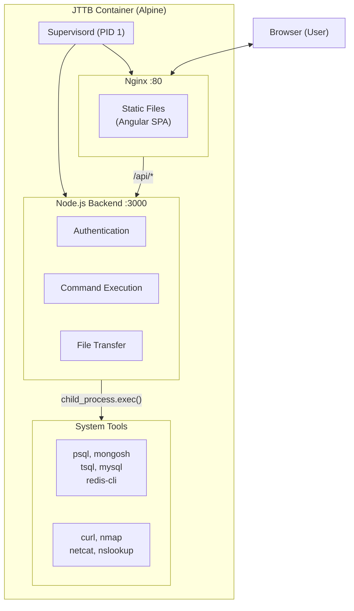
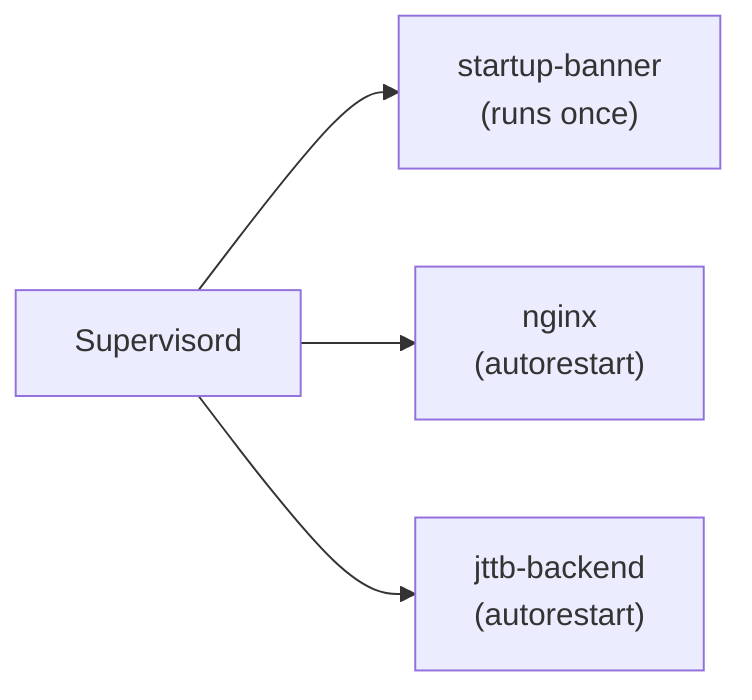
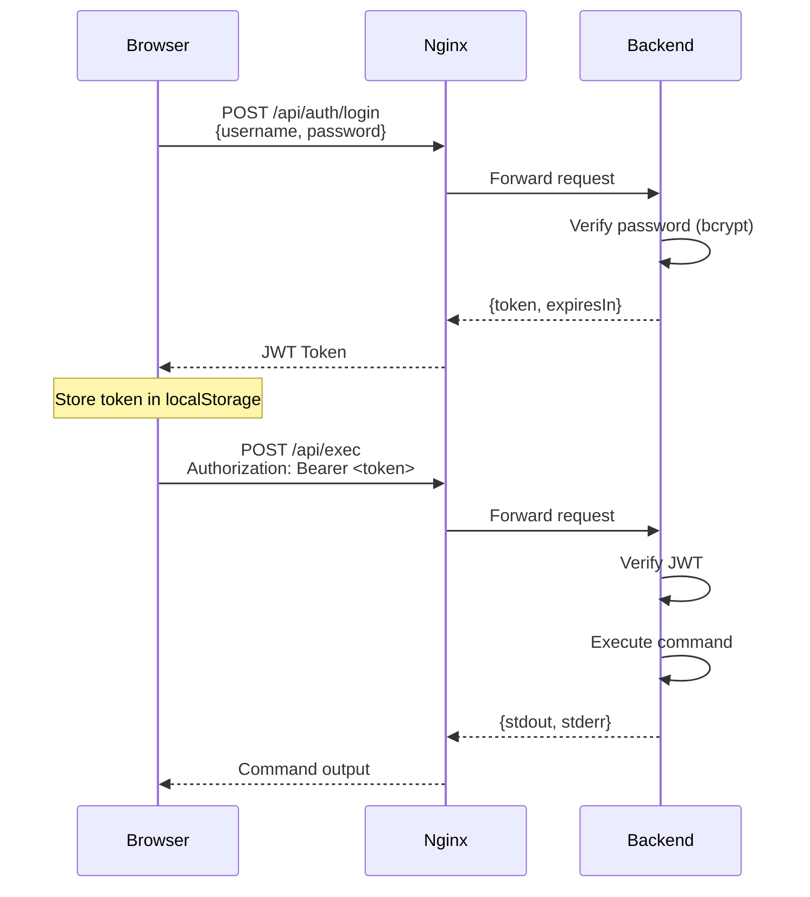
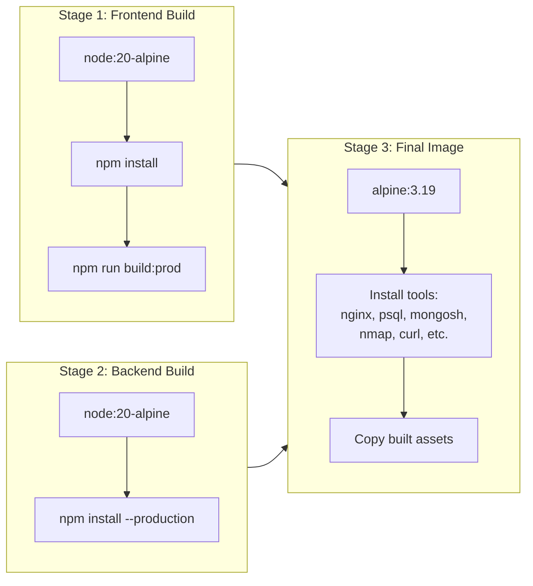
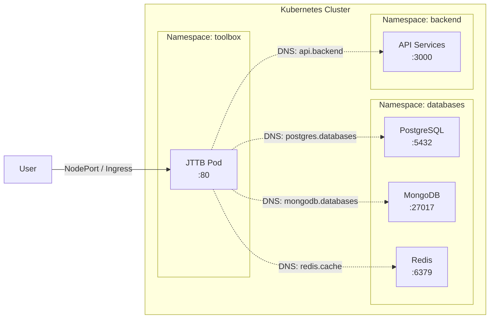

# Architecture

Technical overview of JTTB's design and components.

---

## High-Level Overview



---

## Components

### 1. Supervisord

**Role:** Process manager (PID 1)

Manages both Nginx and the Node.js backend, ensuring they stay running.



### 2. Nginx

**Role:** Reverse proxy + static file server

- Serves the compiled Angular SPA
- Proxies `/api/*` requests to the Node.js backend
- Handles static assets efficiently

**Port:** 80

### 3. Node.js Backend

**Role:** API server

- **Authentication:** JWT-based login with bcrypt password hashing
- **Command Execution:** Runs shell commands via `child_process.exec()`
- **File Transfer:** Upload (multer) and download (streaming)

**Port:** 3000 (internal only)

### 4. Angular Frontend

**Role:** User interface

- Standalone components (Angular 18+)
- Terminal emulator with command history
- Drag & drop file upload
- JWT token management

---

## API Endpoints

| Method | Endpoint | Auth | Description |
|--------|----------|------|-------------|
| GET | `/health` | No | Health check |
| POST | `/api/auth/login` | No | User login |
| GET | `/api/auth/verify` | Yes | Verify token |
| POST | `/api/exec` | Yes | Execute command |
| GET | `/api/download` | Yes | Download file |
| POST | `/api/upload` | Yes | Upload file |

---

## Authentication Flow



---

## Command Execution

Commands are executed using Node.js `child_process.exec()`:

```javascript
exec(command, {
  cwd: currentWorkingDirectory,
  timeout: EXEC_TIMEOUT,        // Default: 30s
  maxBuffer: 1024 * 1024,       // 1MB
  encoding: 'utf8',
  shell: detectedShell          // sh, bash, cmd, powershell
});
```

**Security considerations:**
- All commands require authentication
- Timeout prevents runaway processes
- Buffer limits prevent memory exhaustion
- Commands run with container's user permissions

---

## Docker Build Process



**Final image size:** ~200MB (includes all debugging tools)

---

## Directory Structure

```
/
├── app/
│   ├── jttb-back/
│   │   ├── server.js
│   │   ├── package.json
│   │   └── node_modules/
│   └── jttb-front/
│       └── (compiled Angular files)
├── etc/
│   ├── nginx/http.d/default.conf
│   └── supervisord.conf
├── help.txt
└── var/log/
    └── supervisord.log
```

---

## Included Tools

| Category | Tools |
|----------|-------|
| **Database Clients** | psql, mongosh, mongostat, mongodump, tsql, mysql, redis-cli |
| **Network** | curl, wget, netcat, nmap, nslookup, dig, mtr, traceroute |
| **SSL/TLS** | openssl |
| **Utilities** | jq, bash, ip, ss, netstat, tcpdump |

---

## Resource Requirements

| Resource | Request | Limit |
|----------|---------|-------|
| CPU | 100m | 500m |
| Memory | 128Mi | 512Mi |

Adjust based on expected usage. Heavy database queries or file transfers may require more memory.

---

## Network Flow in Kubernetes


